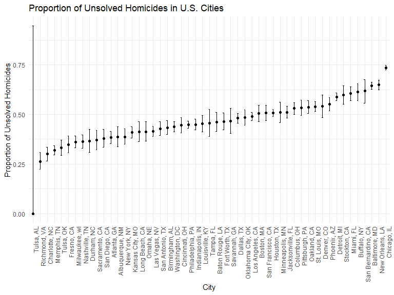

p8105_hw5_cz2750
================
Congrui Zhang
2023-11-13

# Q1

## Data Loading and Processing

``` r
# Loading the homicide data from the GitHub URL
homicide_data <- read_csv("homicide-data.csv")
```

    ## Rows: 52179 Columns: 12
    ## ── Column specification ────────────────────────────────────────────────────────
    ## Delimiter: ","
    ## chr (9): uid, victim_last, victim_first, victim_race, victim_age, victim_sex...
    ## dbl (3): reported_date, lat, lon
    ## 
    ## ℹ Use `spec()` to retrieve the full column specification for this data.
    ## ℹ Specify the column types or set `show_col_types = FALSE` to quiet this message.

``` r
# Creating a city_state variable and summarizing data
homicide_summary <- homicide_data %>%
  mutate(city_state = paste(city, state, sep = ", ")) %>%
  group_by(city_state) %>%
  summarize(
    total_homicides = n(),
    unsolved_homicides = sum(disposition == "Closed without arrest" | disposition == "Open/No arrest")
  )
```

## Proportion Test for Baltimore

``` r
# Subset data for Baltimore, MD
baltimore_data <- filter(homicide_summary, city_state == "Baltimore, MD")

# Conducting the proportion test
baltimore_prop_test <- prop.test(baltimore_data$unsolved_homicides, baltimore_data$total_homicides)

# Tidying the test results
baltimore_tidy <- tidy(baltimore_prop_test)

# Extracting the estimated proportion and confidence intervals
baltimore_estimate <- baltimore_tidy %>%
  select(estimate, conf.low, conf.high)
```

## Proportion Test for All Cities

``` r
# Function to apply prop.test to each city
prop_test_per_city <- function(total, unsolved) {
  prop_test_result <- prop.test(unsolved, total)
  tidy(prop_test_result)
}

# Applying the function to each city
citywise_results <- homicide_summary %>%
  mutate(test_results = map2(total_homicides, unsolved_homicides, prop_test_per_city)) %>%
  unnest(test_results)

# Extracting necessary details
citywise_estimates <- citywise_results %>%
  select(city_state, estimate, conf.low, conf.high)
```

## Plotting the Results

``` r
# Creating the plot
homicide_plot <- ggplot(citywise_estimates, aes(x = reorder(city_state, estimate), y = estimate)) +
  geom_point() +
  geom_errorbar(aes(ymin = conf.low, ymax = conf.high), width = 0.2) +
  theme(axis.text.x = element_text(angle = 90, hjust = 1)) +
  labs(x = "City", y = "Proportion of Unsolved Homicides", title = "Proportion of Unsolved Homicides in U.S. Cities")

# Displaying the plot
print(homicide_plot)
```



# Q2
