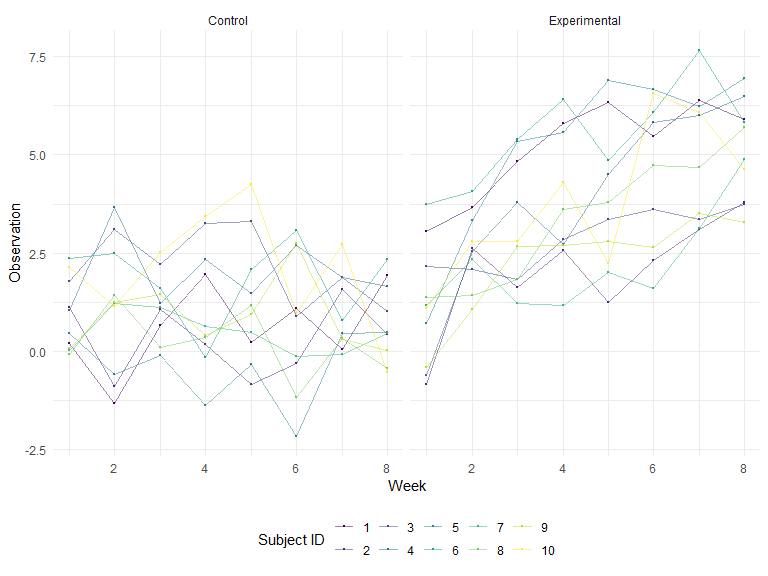

p8105_hw5_cz2750
================
Congrui Zhang
2023-11-13

# Q1

## Data Loading and Processing

``` r
# Loading the homicide data from the GitHub URL
homicide_data <- read_csv("homicide-data.csv",  show_col_types = FALSE)

# Creating a city_state variable and summarizing data
homicide_summary <- homicide_data %>%
  mutate(city_state = paste(city, state, sep = ", ")) %>%
  group_by(city_state) %>%
  summarize(
    total_homicides = n(),
    unsolved_homicides = sum(disposition == "Closed without arrest" | disposition == "Open/No arrest")
  )
```

## Proportion Test for Baltimore

``` r
# Subset data for Baltimore, MD
baltimore_data <- filter(homicide_summary, city_state == "Baltimore, MD")

# Conducting the proportion test
baltimore_prop_test <- prop.test(baltimore_data$unsolved_homicides, baltimore_data$total_homicides)

# Tidying the test results
baltimore_tidy <- tidy(baltimore_prop_test)

# Extracting the estimated proportion and confidence intervals
baltimore_estimate <- baltimore_tidy %>%
  select(estimate, conf.low, conf.high)
```

## Proportion Test for All Cities

``` r
# Function to apply prop.test to each city
prop_test_per_city <- function(total, unsolved) {
  prop_test_result <- prop.test(unsolved, total)
  tidy(prop_test_result)
}

# Applying the function to each city
citywise_results <- homicide_summary %>%
  mutate(test_results = map2(total_homicides, unsolved_homicides, prop_test_per_city)) %>%
  unnest(test_results)

# Extracting necessary details
citywise_estimates <- citywise_results %>%
  select(city_state, estimate, conf.low, conf.high)
```

## Plotting the Results

``` r
# Creating the plot
homicide_plot <- ggplot(citywise_estimates, aes(x = reorder(city_state, estimate), y = estimate)) +
  geom_point() +
  geom_errorbar(aes(ymin = conf.low, ymax = conf.high), width = 0.2) +
  theme(axis.text.x = element_text(angle = 90, hjust = 1)) +
  labs(x = "City", y = "Proportion of Unsolved Homicides", title = "Proportion of Unsolved Homicides in U.S. Cities")

# Displaying the plot
print(homicide_plot)
```


# Q2

## Unzip and List Files

``` r
unzip("hw5_data.zip", exdir = "hw5_data")
files <- list.files("hw5_data/data", full.names = TRUE, pattern = ".*\\.csv$")
```

## Read and Combine Data Files

``` r
data <- map_df(files, ~{
  dat <- read_csv(.x,  show_col_types = FALSE) 

  filename <- basename(.x)
  subject_id <- str_extract(filename, "\\d+")
  arm <- ifelse(str_detect(filename, "con_"), "control", "experimental")

  dat <- dat %>%
    mutate(subject_id = subject_id,
           arm = arm)
}, .id = "file_path")
```

## Tidy the Data

``` r
tidy_data <- data %>%
  clean_names() %>%
  mutate(group = ifelse(grepl("con", arm), "Control", "Experimental")) %>%
  mutate(subject_ID = as.integer(str_extract(subject_id, "[0-9][0-9]"))) %>%
  select(-arm, subject_id) %>%
  pivot_longer(
    cols = starts_with("week"),
    names_to = "week",
    values_to = "observation"
  ) %>%
  mutate(week = as.numeric(gsub("week_", "", week)))
```

## Create the Spaghetti Plot

``` r
tidy_data %>% 
  ggplot(aes(x = week, y =observation, color = as.factor(subject_ID))) +
  geom_point(size=0.2) +
  geom_line(aes(group = subject_ID), alpha=0.5) +
  facet_grid(~group) +
  labs(x = "Week", y = "Observation", col = "Subject ID")
```



## Comment

1)  Observations in the control group fluctuated greatly over the
    eight-week period and did not show a clear trend, suggesting a high
    degree of variability and no consistent response.

2)  The opposite is true for the experimental group, where the results
    show a clear upward trend, implying a systematic increase in
    observations over time.

# Q3

## Set Design Elements

``` r
n <- 30
sigma <- 5
mu_null <- 0
alpha <- 0.05
true_mus <- 1:6
num_simulations <- 5000
set.seed(123)
```

## Function to simulate one dataset and perform a t-test

``` r
simulate_t_test <- function(mu, n, sigma, mu_null) {
  sample_data <- rnorm(n, mean = mu, sd = sigma)
  test_result <- t.test(sample_data, mu = mu_null)
  tidy(test_result)
}
```

## Function to simulate datasets and extract results for a given mu

``` r
simulate_power <- function(mu, n, sigma, mu_null, num_simulations) {
  simulations <- replicate(num_simulations, simulate_t_test(mu, n, sigma, mu_null), simplify = FALSE)
  estimates <- map_dbl(simulations, ~ .x$estimate)
  p_values <- map_dbl(simulations, ~ .x$p.value)

  tibble(
    true_mu = mu,
    estimate = estimates,
    p_value = p_values
  )
}
```

## Perform simulations for each true value of μ

``` r
results <- map_dfr(true_mus, ~simulate_power(.x, n, sigma, mu_null, num_simulations))
```

## Calculate power for each true value of μ

``` r
power_analysis <- results %>%
  group_by(true_mu) %>%
  summarize(
    power = mean(p_value < alpha),
    average_estimate = mean(estimate),
    average_estimate_rejected = mean(estimate[p_value < alpha])
  )
```

## Plot Power vs. True Value of μ

``` r
ggplot(power_analysis, aes(x = true_mu, y = power)) +
  geom_point() +
  geom_line() +
  labs(
    title = "Power vs. True Value of μ",
    x = "True Value of μ",
    y = "Power"
  )
```


As the true value of μ increases, the power of the test also increases.
This is a common relationship in statistical tests: larger effect sizes
generally lead to higher power. In other words, when the true mean (μ)
is farther from the null hypothesis value, it becomes easier for the
test to detect a statistically significant difference, thereby rejecting
the null hypothesis more frequently.

## Plot Average Estimate of μ

``` r
ggplot(power_analysis, aes(x = true_mu, y = average_estimate)) +
  geom_point() +
  geom_line() +
  labs(
    title = "Average Estimate of μ vs. True Value of μ",
    x = "True Value of μ",
    y = "Average Estimate of μ"
  )
```


The sample average of the average estimate of μ is an unbiased estimate
of the true mean since the points lie on a line that would pass through
the origin if extended, indicating that on average, the t-test is
accurately estimating the true mean.

## Plot Average Estimate of μ When Null is Rejected

``` r
ggplot(power_analysis, aes(x = true_mu, y = average_estimate_rejected)) +
  geom_point(color = "blue") +
  geom_line(color = "blue") +
  labs(
    title = "Average Estimate of μ When Null is Rejected vs. True Value of μ",
    x = "True Value of μ",
    y = "Average Estimate of μ When Null is Rejected"
  )
```


This plot, which overlays the average estimate of μ^ only for samples
where the null was rejected, shows that these average estimates are also
closely aligned with the true values of μ, but there is a tendency for
the estimates to be higher than the true mean, particularly at lower
true values of μ. This can happen because when the null hypothesis is
false, smaller sample means are less likely to lead to a rejection of
the null. Hence, the means from samples that lead to a null rejection
are biased upward. This bias is more pronounced at lower true values of
μ, where the difference from the null is smaller and hence more
susceptible to sampling variability.

## The answer OF the question, “Is the sample average of μ^ across tests for which the null is rejected approximately equal to the true value of μ?”

The sample average of μ^ across tests where the null is rejected is not
perfectly equal to the true value of μ due to the bias introduced by the
selection of only significant results. This bias is a result of the
sampling distribution of the test statistic under the alternative
hypothesis being centered around a value that is more extreme than the
true value of μ. In other words, when a test is significant,
particularly with smaller effect sizes, it is often because the sample
mean is somewhat larger (more extreme) than the true mean.
